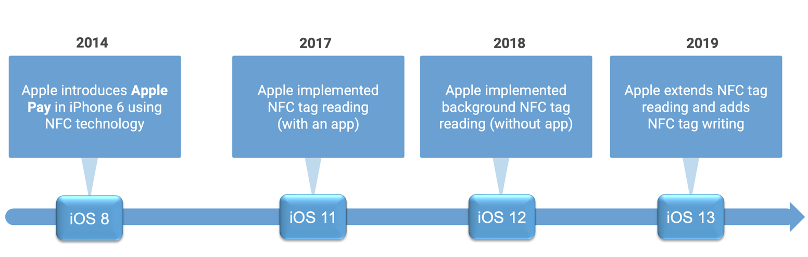
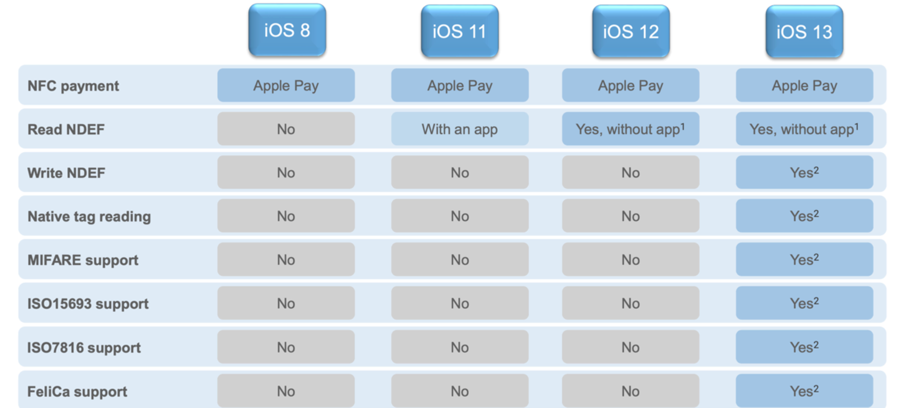
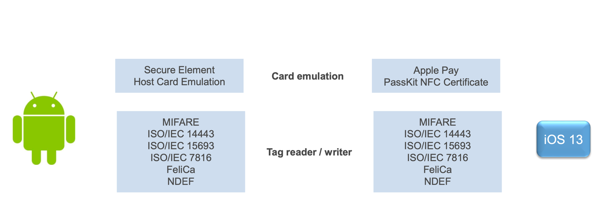
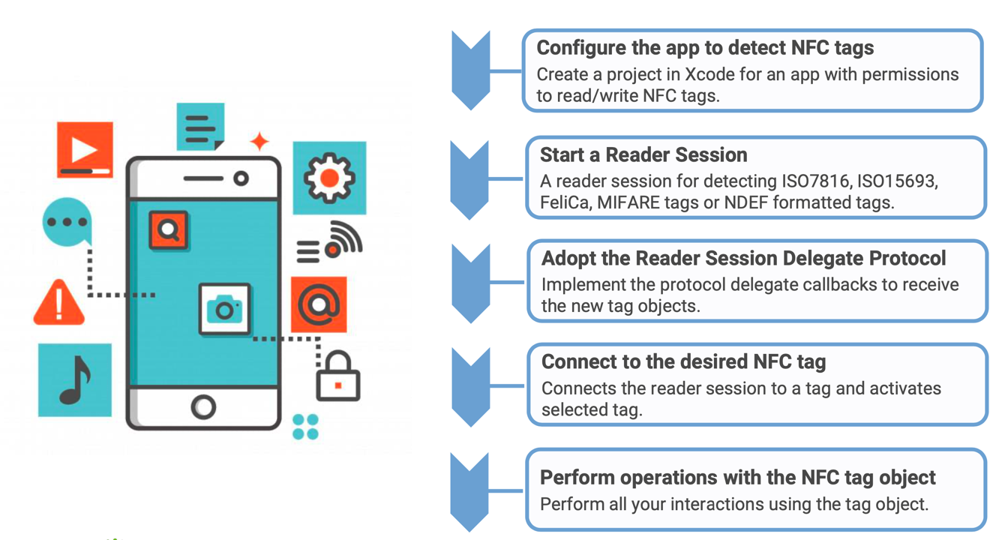
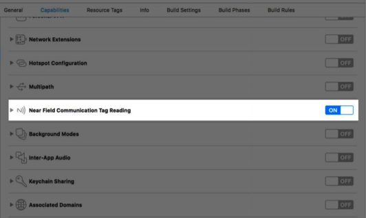
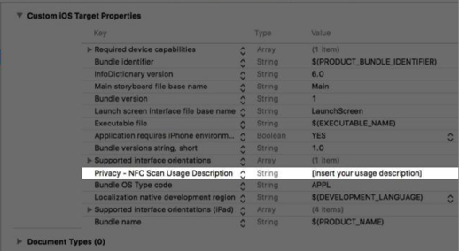
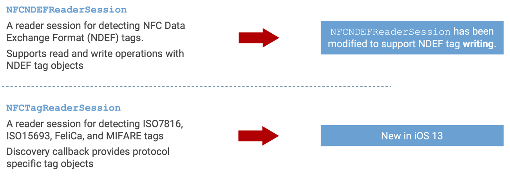
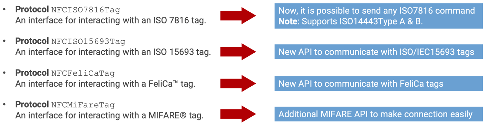
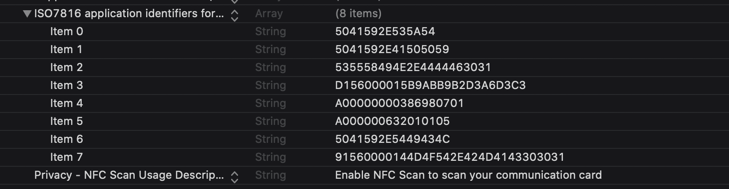
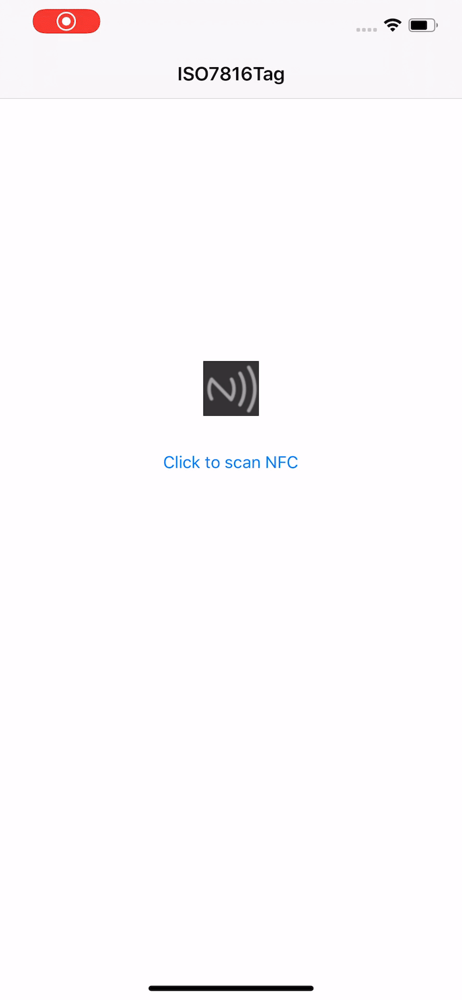

#
iOS NFC
#### 一、简介
本文是关于iOS13 NFC技术的相关学习及探索

#### 二、iOS13关于NFC能力介绍
* 在iOS13上Apple 扩展了关于NFC相关的技术能力

* 关于iOS不同版本对NFC支持信息

* 在iOS 13系统上NFC的技术支持更加的强大
	1. iOS13系统基本支持目前已经部署的NFC协议的读写操作
	2. 开发者可以通过iOS Core NFC Framework提供的native protocols与 tags 直接通信

* 主要的（iOS & Android）智能手机平台都以提供了对NFC大范围的支持，不用担心平台之间的限制

#### 三、iOS13上NFC技术的使用场景
* 智能家居相关的设备：门禁、室内温度调节器等
* 工业生产中相关的设备：信号控制器、机械控制
* 健康和医疗保健：健康追踪、和智能手表的交互
* 在ESL和照明系统：信号灯、Led 控制

#### 四、iOS 13 使用NFC的步骤
* 开始一个支持NFC功能的项目步骤如下:

* 配置工程支持添加对NFC功能的支持

	
	
	
* 开启NFC Reader Session 通常是用来扫描和发现NFC的标签，目前iOS13支持如下的两种方式：

   
   

* 关于NFCNDEFReaderSession的读取与写入，Apple提供了很详细的例子：[BuildingAnNFCTagReaderApp](https://docs-assets.developer.apple.com/published/3111a8e27d/BuildingAnNFCTagReaderApp.zip)
* 在iOS13中新引入了NFCTagReaderSession API，该API允许你的应用在对应的技术下扫描并连接
	
* 如果你需要支持ISO7816, ISO15693, FeliCa, and MIFARE tags，则需要在info.plist 上添加支持对应的AID，例如使用ISO7816：
	

#### 五、上海公交卡(ISO7816)
> 由于ApplePay支持上海公交卡刷卡，刚好手里有上海公交卡，所以就基于上海公交卡完成了如下的探索

1. 开启NFC扫描，
	> 上海公交tag 属于ISO7816tag，AID：A00000000386980701
		
		public func startReaderSession() {
        
	        self.session = NFCTagReaderSession(pollingOption:[.iso14443], delegate: self)
	        self.session?.begin()
	        self.session?.alertMessage = "Hold your iPhone near the item to learn more about it"
        }
        
2. 发送获取数据的指令
> 在扫描结果回调的delegate中发起连接并发送请求数据对应的指令

		public func tagReaderSession(_ session: NFCTagReaderSession, didDetect tags: [NFCTag]) {
	        if tags.count > 1 {
	            self.delegate?.ISO7816Reader(self, withError: LSISO7816TagError.countExceed)
	            return
	        }
	        let tag = tags.first!
	        
	        session.connect(to: tag) { (error) in
	            
	            guard tag.isAvailable else{
	                       print("tag.UnAvailable")
	                       return;
	                   }
	            print("this is start connect\(String(describing: error))")
	            guard error == nil else {
	                session.invalidate(errorMessage: "Failed to connect")
	                self.delegate?.ISO7816Reader(self, withError: LSISO7816TagError.cannotConnect)
	                return
	            }
	
	            guard case .iso7816(let ios7816Tag) = tag else {
	                self.delegate?.ISO7816Reader(self, withError: LSISO7816TagError.typeMismatch)
	                return
	            }
	            print(ios7816Tag.type)
	            print(ios7816Tag.isAvailable)
	            print(ios7816Tag.initialSelectedAID)
	            
	            self.readBinary(tag: ios7816Tag, data: Data()) { (res, sw1, sw2, error) in
	                
	                guard error == nil && (sw1 == 0x90 && sw2 == 0) else {
	                    let msg = self.decodeError(sw1: sw1, sw2: sw2)
	                    session.invalidate(errorMessage: msg)
	                    return
	                }
	                let publishCardInfo =  LSPublishCarInfo(res)
	                self.carInfo?.cardPublistInfo = publishCardInfo
	                
	            }
	                
	        
	            self.selectBalance(tag: ios7816Tag, data: Data()) { (respondeData, sw1, sw2, error) in
	
	                guard error == nil && (sw1 == 0x90 && sw2 == 0) else {
	                    let msg = self.decodeError(sw1: sw1, sw2: sw2)
	                    session.invalidate(errorMessage: msg)
	                    return
	                }
	
	                self.carInfo?.balance = String((respondeData.toIntReversed(0, 3)/100))
	                
	                print("读取卡的金额：\(respondeData.toIntReversed(0, 3)/100)")
	
	            }
	        }
	    }

3. 指令及数据解析：
	> NFC读取公交卡信息的技术主要困难点在于指令点发送及数据的解析,sw1 == 0x90 && sw2 == 0 表示发送的指令正确
	
		internal func selectBalance(tag:LSNFCReaderTag, data:Data, completionHandler: @escaping LSNFCReaderCompletionHandler)
	    {
	        let apdu = NFCISO7816APDU(instructionClass: 0x80, instructionCode: 0x5C, p1Parameter: 0x00, p2Parameter: 2, data: data, expectedResponseLength: 0x04)
	        tag.sendCommand(apdu: apdu, completionHandler: completionHandler)
	        
	    }
	

4. 示例
 > 以读取上海公交卡为例，读取并解析了部分公交卡中的信息，如：余额、乘车记录等
 
	
	
	
#### 六、其他

* 示例的demo地址为:[LSNFC]()
* FeliCa 类型的可以参考：[TRETJapanNFCReader]()
* 使用到的文档[iso7816-4-annex-e-examples-card-profiles](https://cardwerk.com/iso7816-4-annex-e-examples-card-profiles)、[智能卡手册](https://wiki.nfc.im/books/%E6%99%BA%E8%83%BD%E5%8D%A1%E6%89%8B%E5%86%8C/page/%E5%8C%97%E4%BA%AC%E5%B8%82%E6%94%BF%E5%85%AC%E4%BA%A4%E4%B8%80%E5%8D%A1%E9%80%9A%EF%BC%88bmac%EF%BC%89)

